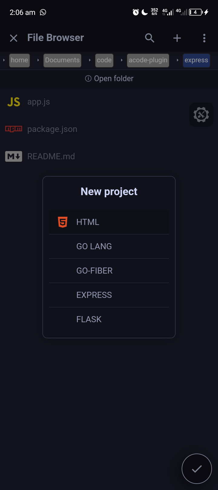

# Introduction

This plugin expands your Acode  with additional project templates.

### Currently available projects:

- Node.js with Express

- Python with Flask

- Go with Fiber

- More templates coming soon!

# Installation

1. Click the install button.

2. Reload the application to apply the changes.

# Contribution

We welcome contributions! Feel free to open issues or submit pull requests on GitHub.

